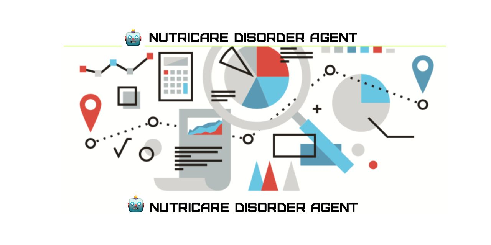
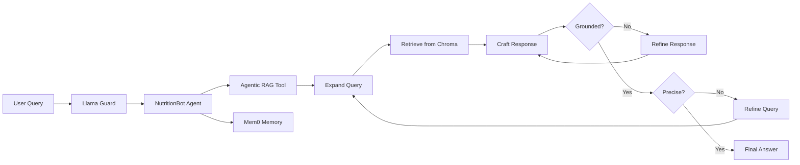

# SMART Nutrition Disorder Specialist Bot

A **Retrieval-Augmented Generation (RAG)** chatbot that integrates comprehensive nutritional literature—including the **Nutritional Medical Reference**—to help healthcare professionals get instant, accurate, and contextually relevant answers about nutritional disorders.

Originally developed in **Google Colab** as part of a Generative AI capstone project, then packaged as a **Streamlit** application and deployed on [Hugging Face Spaces](https://huggingface.co/spaces/jasonmonroe/smart-nutri-disorder-specialist-bot).



---

## Overview

Nutrition disorder guidance is spread across dense clinical references, guidelines, and research. This project turns that material into a searchable knowledge base and layers an **agentic RAG workflow** on top so answers stay grounded in source documents rather than model memory alone.

The bot is designed for **healthcare professionals** who need quick, evidence-aligned information on symptoms, causes, treatment options, and preventive measures—while maintaining safety guardrails and conversational continuity across sessions.

### Business context

The project is framed around a collaboration between the **Global Nutrition Health Organization** and **InnoviTech Solutions**: a Gen AI system that streamlines extraction of vital nutritional information from trusted references (including the Nutritional Medical Reference) so clinicians spend less time on manual literature searches and more time on patient care.

### What it does

- **Ingests** PDF literature from the Nutritional Medical Reference corpus using LlamaParse
- **Indexes** semantically chunked content (plus hypothetical questions) in **Chroma** vector stores
- **Retrieves** relevant passages through query expansion, similarity search, and structured retrieval
- **Generates** clinically structured responses constrained to retrieved context
- **Self-corrects** via groundedness and precision scoring loops (LangGraph)
- **Moderates** user input with **Llama Guard** (via Groq)
- **Remembers** prior interactions per user with **Mem0**

---

## Notebooks

The `notebooks/` directory documents the full development journey from the original Google Colab starter through the finished implementation.

| File | Description |
|------|-------------|
| [`GA_NLP_Project_3_DetailedHints_Learner's_Notebook.ipynb`](notebooks/GA_NLP_Project_3_DetailedHints_Learner's_Notebook.ipynb) | **Original starter notebook** from Google Colab (Great Learning capstone). Contains the business use case, learning objectives, and guided hints for building the RAG pipeline step by step. |
| [`nutricare_disorder_agent.ipynb`](notebooks/nutricare_disorder_agent.ipynb) | **Complete implementation** — the finished notebook with all code, outputs, and workflow definitions. This is the authoritative reference for how the system was built. |
| [`nutricare_disorder_agent.html`](notebooks/nutricare_disorder_agent.html) | **Browser-friendly export** of the complete notebook. Open this file in any web browser to read the full project without Jupyter or Colab. |

### Notebook structure

The complete notebook is organized into three major sections:

**Section 1 — Data parsing and preparation**
- Install libraries and configure API keys
- Unzip and load Nutritional Medical Reference PDFs
- Parse documents and extract tables with LlamaParse
- Semantic chunking and Chroma vector storage
- Hypothetical question generation for improved retrieval

**Section 2 — Intelligent agent with retrieval and safety**
- LangGraph agentic RAG workflow (query expansion → retrieval → generation → evaluation loops)
- Llama Guard input filtering
- Mem0 conversational memory
- Interactive Nutrition Disorder Specialist agent

**Section 3 — Hugging Face deployment**
- Environment and secrets configuration
- Porting the LangGraph agent to a deployable app
- Publishing to Hugging Face Docker Spaces

The production [`app.py`](app.py) Streamlit application implements the Section 2–3 logic for local and hosted use.

---

## Architecture



| Layer | Technology |
|-------|------------|
| UI | Streamlit |
| Orchestration | LangGraph, LangChain |
| LLM & embeddings | OpenAI (`gpt-4o-mini`, `text-embedding-3-small`) |
| Vector store | ChromaDB |
| Document parsing | LlamaParse, LlamaIndex |
| Safety | Llama Guard 4 (Groq) |
| Session memory | Mem0 |

---

## Prerequisites

- **Python 3.11**
- API keys for:
  - [OpenAI](https://platform.openai.com/) (or compatible endpoint)
  - [Groq](https://console.groq.com/) (Llama Guard)
  - [Meta Llama / LlamaIndex](https://developers.llamaindex.ai/llamaparse/general/api_key/) (LlamaParse)
  - [Mem0](https://mem0.ai/)
  - [Hugging Face](https://huggingface.co/settings/tokens) (Space deployment)
  - [Weights & Biases](https://wandb.ai/) (optional; experiment tracking in the notebook)
- The **Nutritional Medical Reference** PDFs (`Nutritional_Medical_Reference.zip`, or your own copy in `Nutritional Medical Reference/`)
- A pre-built Chroma index (`nutritional_db/`), created by running Section 1 of the notebook

---

## Environment setup

### 1. Clone the repository

```bash
git clone https://github.com/jasonmonroe/nutricare-disorder-agent-google-colab.git
cd nutricare-disorder-agent-google-colab
```

### 2. Create a Python 3.11 virtual environment

**macOS / Linux**

```bash
python3.11 -m venv .venv
source .venv/bin/activate
python -m pip install --upgrade pip
```

**Windows**

```powershell
py -3.11 -m venv .venv
.\.venv\Scripts\activate
python -m pip install --upgrade pip
```

Verify the interpreter version:

```bash
python --version
# Python 3.11.x
```

### 3. Install dependencies

```bash
pip install streamlit \
  langchain langchain-core langchain-community langchain-experimental langchain-openai \
  langgraph \
  llama-parse llama-index \
  chromadb \
  openai groq \
  mem0ai \
  python-dotenv \
  nest-asyncio \
  numpy pydantic
```

> **Note:** If `pip install mem0ai` fails, try `pip install mem0`. The import used in code is `from mem0 import MemoryClient`.

### 4. Configure environment variables

Copy the example environment file and add your credentials:

```bash
cp env.example .env
```

[`env.example`](env.example) is a boilerplate template listing every variable the project expects, with links to each provider's documentation. Open `.env` and fill in your API keys:

| Variable | Purpose |
|----------|---------|
| `GROQ_API_KEY` | Groq Cloud — Llama Guard safety filtering |
| `HF_TOKEN` | Hugging Face — model and Space authentication |
| `LLAMA_KEY` | LlamaIndex / LlamaParse — PDF parsing |
| `MEM0_API_KEY` | Mem0 — conversational memory |
| `OPENAI_API_KEY` | OpenAI — chat and embeddings |
| `OPENAI_API_BASE` | API endpoint (default: `https://api.openai.com/v1`) |
| `OPENAI_EMBEDDING_MODEL` | Embedding model (default: `text-embedding-3-small`) |
| `WANDB_API_KEY` | Weights & Biases — optional experiment tracking |

The application loads these via `python-dotenv` at startup. `app.py` requires all keys except `WANDB_API_KEY` unless you modify `check_program_keys()`.

> **Security:** Never commit `.env` to version control. Only `env.example` (with empty values) belongs in the repo.

### 5. Prepare the knowledge base

**Option A — Use the bundled archive**

Place `Nutritional_Medical_Reference.zip` in the project root (included in this repo). If the `Nutritional Medical Reference/` directory is not present, `app.py` extracts the archive automatically on first run.

**Option B — Build the vector index from the notebook**

Run **Section 1** of [`notebooks/nutricare_disorder_agent.ipynb`](notebooks/nutricare_disorder_agent.ipynb) to parse PDFs, chunk content, generate hypothetical questions, and persist Chroma collections (including `nutritional_db/`).

---

## Running the application

### Streamlit app (local)

With the virtual environment activated and `.env` configured:

```bash
streamlit run app.py
```

Streamlit opens a local URL (typically `http://localhost:8501`). Enter a display name to start a session, then ask questions about nutritional disorders. Type `exit` to end the conversation.

### Jupyter notebook (development / reproduction)

```bash
jupyter notebook notebooks/nutricare_disorder_agent.ipynb
```

Or open [`notebooks/nutricare_disorder_agent.html`](notebooks/nutricare_disorder_agent.html) directly in a browser for a read-only walkthrough of the complete project.

### Live demo

A hosted version is available on Hugging Face:

**[smart-nutri-disorder-specialist-bot](https://huggingface.co/spaces/jasonmonroe/smart-nutri-disorder-specialist-bot)**

---

## Project structure

```
nutricare-disorder-agent-google-colab/
├── app.py                                          # Streamlit app (Section 2–3 port)
├── env.example                                     # Environment variable template
├── notebooks/
│   ├── GA_NLP_Project_3_DetailedHints_Learner's_Notebook.ipynb  # Original Colab starter
│   ├── nutricare_disorder_agent.ipynb              # Complete implementation
│   └── nutricare_disorder_agent.html               # Browser-viewable export
├── Nutritional_Medical_Reference.zip               # Source PDF archive
├── Nutritional Medical Reference/                  # Extracted reference PDFs (runtime)
├── nutritional_db/                                 # Chroma vector store (from Section 1)
├── vector_store/                                   # Additional Chroma collections from notebook
├── nda-github-social-preview.jpg
├── LICENSE
└── README.md
```

---

## Google Colab origin

This project started in **Google Colab** as **Project 3: Smart Nutrition Disorder Specialist Bot** — a Generative AI capstone focused on building and deploying an agentic RAG system. The original learner notebook ([`GA_NLP_Project_3_DetailedHints_Learner's_Notebook.ipynb`](notebooks/GA_NLP_Project_3_DetailedHints_Learner's_Notebook.ipynb)) provided the scaffold; the complete notebook ([`nutricare_disorder_agent.ipynb`](notebooks/nutricare_disorder_agent.ipynb)) contains the full working pipeline.

Development progressed through:

1. **Ingestion** — LlamaParse PDF parsing, table extraction, semantic chunking
2. **Indexing** — Chroma vector stores with hypothetical questions for hybrid retrieval
3. **Agentic RAG** — LangGraph workflow with groundedness and precision self-correction
4. **Safety & memory** — Llama Guard filtering and Mem0 session persistence
5. **Deployment** — Streamlit UI packaged for Hugging Face Spaces (`app.py`)

---

## Disclaimer

This tool is intended to **support** clinical and educational workflows. It does **not** replace professional medical judgment, diagnosis, or treatment. Always verify critical information against primary sources and current clinical guidelines. Responses are generated from retrieved context and may be incomplete; the application explicitly signals when context is insufficient.

---

## License

[MIT](LICENSE) — Copyright (c) 2026 Jason Monroe, courtesy of MONROE LABS.

---

## Author

**Jason Monroe**  
[jason@jasonmonroe.com](mailto:jason@jasonmonroe.com)
